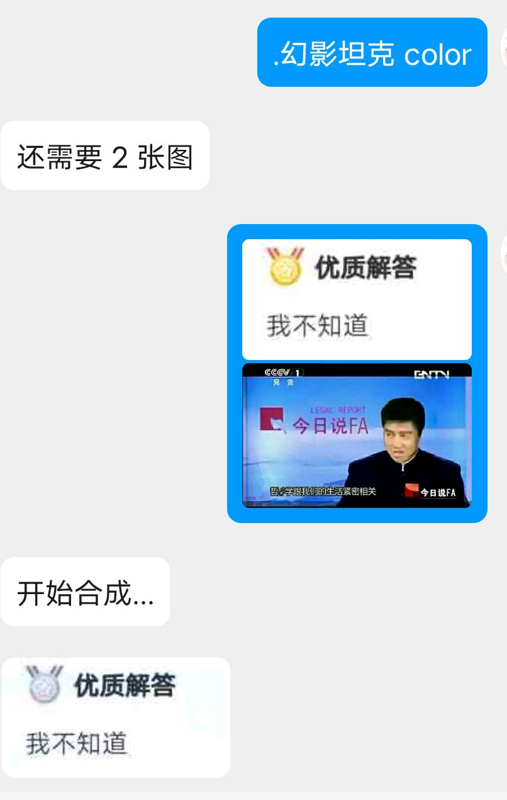
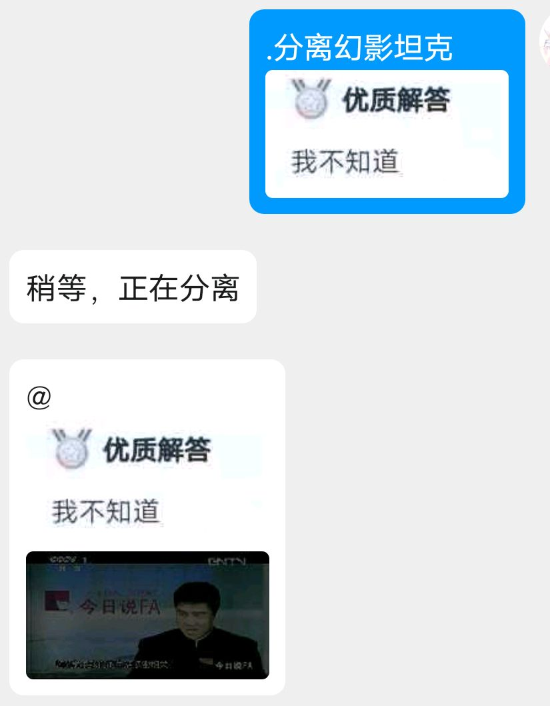
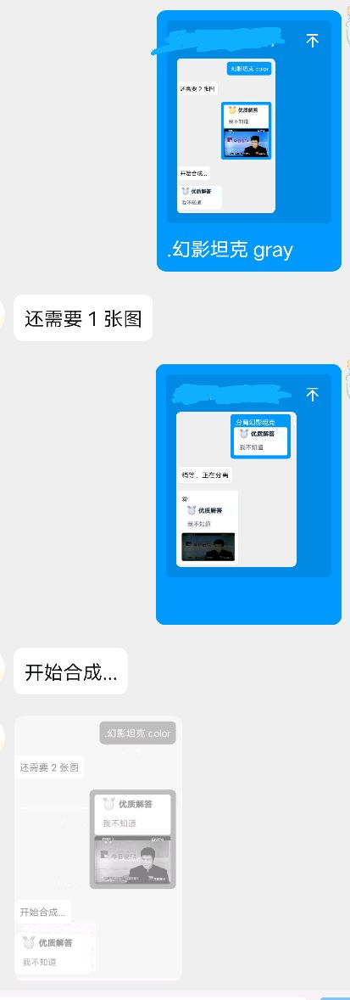

<div align="center">

# 合成幻影坦克图

</div>

<p align="center">
  
  <a href="https://github.com/RafuiiChan/nonebot_plugin_miragetank/blob/main/LICENSE">
    
  </a>
  
  <a href="https://github.com/nonebot/nonebot2">
    
  </a>
  
</p>

## 版本

v0.2.0  - 多平台适配（ 基于 [plugin-alconna](https://github.com/nonebot/plugin-alconna) ）

v0.1.4  - 适配 nonebot 正式版

v0.1.3  - 修复部分 bug (~~新增若干bug~~), 更灵活的参数获取（可使用回复中的图片）, 优化（或许）了点 gray 模式合成的图片的效果

v0.1.2  - 可指定分离时的里图的亮度增强值

v0.1.0  - 增加分离幻影坦克功能

v0.0.5  - 适配了 rc 版本


## 安装

通过`pip`或`nb`安装，也可使用 `pdm`/`poetry` 等依赖管理工具添加，方式参考使用 `pip` 的安装方法 ；

命令

1. 安装完在 `pyproject.toml` 中手动添加插件名以加载插件，或在 `bot.py` 中 (如果有) 使用 `nonebot.load_plugin` 加载 
```
pip install nonebot_plugin_miragetank
```
2. 使用 `nb-cli` , 需要在 bot 项目根目录下执行
```
nb plugin install nonebot_plugin_miragetank
```

## 功能

生成幻影坦克图（在黑白背景下显示不同的图） 与 分离幻影坦克图

<details>
<summary>合成幻影坦克图示例</summary>


</details>

<details>
<summary>分离幻影坦克图示例</summary>


</details>

<details>
<summary>从回复的消息中获取图片进行合成</summary>


</details>


## 命令

* `幻影坦克` / `miragetank` / `合成幻影坦克` / `生成幻影坦克` 

* `分离幻影坦克`

⚠ 需要 nonebot2 配置的命令前缀，如果没配置默认 `/` ,即发送`/miragetank`可触发

### 合成图片需要参数：
* 合成模式: `gray`或`color` （后者合成的里图是彩色的）
* 至少两张图片
* 可随时取消命令（发送 `取消` 即可）

### 分离图片需要参数：
* 一张幻影坦克图片

* 可选参数：需要增强的亮度，取值建议 1~6，值越大分离出的里图（即黑底状态下的图片）的亮度越高，默认是 2 ，便于查看

## 示例（不包含交互过程）
* `/合成幻影坦克 color [图片1] [图片2]`

* `/合成幻影坦克 [图片1] [图片2]`

* `/合成幻影坦克 gray`

* `/分离幻影坦克 [图片]`

* `/分离幻影坦克 [图片] 5.5`

* `/分离幻影坦克 [图片] 3.3`

* `/分离幻影坦克 4.9`


## 致谢
幻影坦克合成算法来自 [MirageTankGO](https://github.com/Aloxaf/MirageTankGo)
