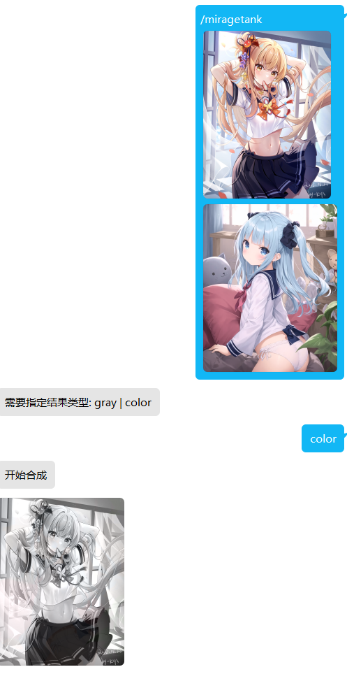
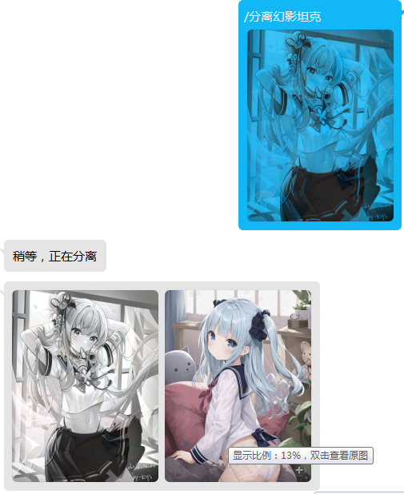

# 合成幻影坦克图

  
  
  
  
  
  
  

## 版本

v0.1.0  - 增加分离幻影坦克功能

v0.0.5  - 适配了 rc 版本

## 安装

1. 通过`pip`或`nb`安装；

命令

`pip install nonebot_plugin_miragetank`

`nb plugin install nonebot_plugin_miragetank`

## 功能

生成幻影坦克图（在黑白背景下显示不同的图） 与 分离幻影坦克图（不过效果感觉不是很好，最好用来分离本插件合成的图，否则效果可能更差）

## 命令

`幻影坦克` / `miragetank`

`分离幻影坦克`

⚠ 需要 nonebot2 配置的命令前缀，如果没配置默认 `/` ,即发送`/miragetank`可触发

### 需要参数：
合成模式: `gray`或`color` （后者合成的里图是彩色的）

至少两张图片

可随时取消命令

## 致谢
幻影坦克合成算法来自 [MirageTankGO](https://github.com/Aloxaf/MirageTankGo)
